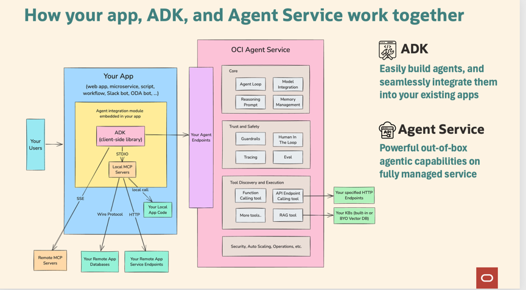
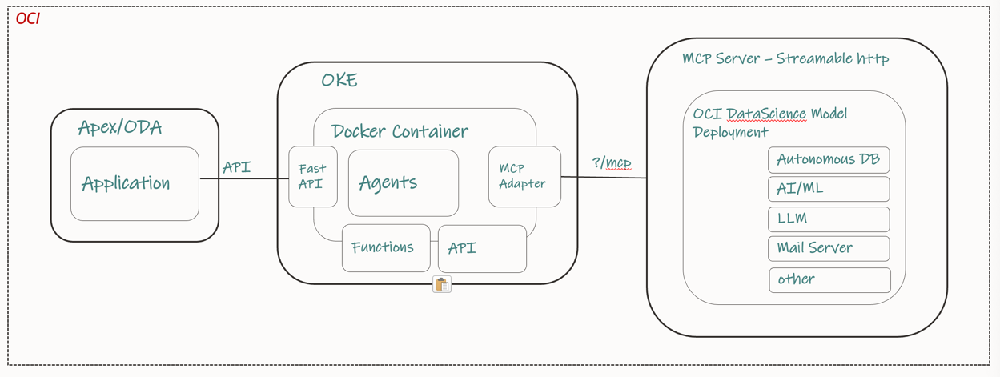

### Oracle Agent Development Kit (ADK) for building Agentic AI applications

#### Understanding the Agentic Framework: A Blueprint for Autonomous system
> https://github.com/aojah1/agents/blob/main/Agentic%20Framework_1.2_Feb03_MM_Anup.pdf

### ADK REFERENCE ARCHITECTURE
#### How it Works

Typically your ADK code is embedded in a larger app and is deployed in your environment. Your larger app might be a web app, a Slackbot, a service, or a a script.

Through ADK function tools, you can integrate an agent with your local codebase, your remote databases, remote microservices, and so on using the authentication that's native to your environment.

The ADK calls the agent endpoint, exposed by OCI Generative AI Agents service, which runs the agent loop remotely to your environment.

When the agent loop decides to call a hosted tool (like a RAG tool), that calls happens without going back to ADK.

When the agent loop decides to call the local function tools, the control is returned back to the ADK. The ADK calls your local function tools, and submits the function tool output back to Generative AI Agents, which then continues the next iteration of the agent loop.

## Key Concepts of how the ADK Landing Zone is configured

### Applications
> An application is what gets deployed at the client side, for users or machines to interact with.
> Apps can be exposed either as an API or a UI.

### Agent Teams
> A structured sequence of steps or actions that the AI Agent follows to accomplish a specific business task or answer a user query.
Workflow patterns such as Supervisor and Swarm makes up an Agent Team.

### Agents
> Agents handles specific task and is equipped with specific skills that enables it to carry out task. Consider this as a worker behind the scenes to perform actual actions or task that the agent is suppose to deliver to the user.
Agent can connect to other systems, API's or tools, which allows the agent to utilize information from different data sources or business functions.

### Prompt Engineering
> Topics: 
>> Topics define the scope, intent and purpose of an Agent. Topics further refine the Agent's scope and purpose - this is added to the system prompt in instructing an LLM 
Use a consistent pather
Subject Area >> Intent Recognition >> Conversational Flow >> Tool/System integrations >> Contextual Responses

> System Prompt:
>> Each agent has a system prompt. The system prompt defines the Agents personas and capabilities. It establishes the tool it can access. It also describe how the Agent should think about achieving any goals or task for which it was designed.
Use a consistent pattern : 
CONTEXT >> ROLE >> OBJECTIVE >> FORMAT >> TONE / STYLE >> CONSTRAINTS

### llm
> One common place to configure all LLMs the agents are going to use.

### METRO
> MONITORING >> EVALUATION >> TRACING >> REPORTING > OBSERVABILITY

### MCP Server - 

#### The Model Context Protocol (MCP) is an open standard that enables developers to build secure, two‑way connections between their data sources and AI-powered tools, acting like a “USB‑C port” for AI models to access external context 

> MCP Server 1: 
    >> Deploy Custom functions as tools and make it available through MCP Server
    >>Follow this instruction on how to deploy your tools (Custom Functions) into Oracle DataScience using MCP architecture
https://blogs.oracle.com/ai-and-datascience/post/hosting-mcp-servers-on-oci-data-science

> MCP Server 2:
    >> Deploy Select AI based tools and make is available through OCI ADW
    >> Reference link goes here ....

### MCP Client - 
>> Support for MCP client is available on ADK through installation of 'oci-2.154.1+preview.1.228'
>> A sample code for MCP based agent can be found under
>>  python3.13 -m src.agents.getinsights

### Getting started with OCI Agents in 2 step :
#### Step 1: Infra Provisioning

> Provisioning an agent endpoint using the OCI Console. 

> You create an agent instance in the cloud, and provision an agent endpoint under that agent instance. 

> No need to configure routing instructions and tools in UI. ADK automates that for you.

#### Step 2: Configure your development environment

### Clone the repository
git clone https://github.com/aojah1/adk_projects.git

### Optional commands
How to actually get Python 3.13 on macOS (change it for your machine)
    
    Option 1 : Homebrew (simplest)
    brew update
    brew install python@3.13          # puts python3.13 in /opt/homebrew/bin
    echo 'export PATH="/opt/homebrew/opt/python@3.13/bin:$PATH"' >> ~/.zshrc
    exec $SHELL                       # reload shell so python3.13 is found
    python3.13 --version              # → Python 3.13.x
    
    Option 2 : pyenv (lets you switch versions)
    brew install pyenv
    pyenv install 3.13.0
    pyenv global 3.13.0
    python --version                  # now 3.13.0

### Configuring and running the agent

    python3.13 -m venv .venv
    source .venv/bin/activate

### Installing all the required packages
#### After you create a project and a virtual environment, install the latest version of required packages:

    python3.13 -m pip install -r requirements.txt

### Authenticating your ADK app to OCI

> The ADK provides an AgentClient class to simplify handling authentication and management of agent resources. Four authentication types are supported. The API key authentication is the default and most common method for authenticating with OCI services, and this is what we will be using in this project.

### Configuring your .env (config) file
Rename the adk_projects/config/sample_.env to adk_projects/config/.env 

Change the config variables based on your agents requirements

### Configuring and running an agent - Quick Test

    python3.13 -m src.examples.test_setup  

### Best practices to follow while building an agent. 
#### Below, you will see an example of how to build an agent called 'taxagent' that has 2 tools - RAG Tool and a CustomFunction.
#### The examples demonstrate also all the steps required to achieve the final outcome - agents to answer tax related questions.

#### Step 1: Build the tools required.
> Based on the business requirements, create tools that would be necessary to execute that business functions.
> Once tools are created, they are visible within the Tools Project and available for use by agents.

CustomFunction --> 

    python3.13 -m src.tools.custom_function_tools

RAG Tool (Pre-built tool available through OCI GenAI Agent Service --> 

    oci.addons.adk.tool.prebuilt import AgenticRagTool

#### Step 2: Topic - Defines the areas of expertise through instructions that set the boundaries and constraints for agent conversations and abilities.
> Topic: src/prompt_engineering/topics/tax_auditor.py
Instructions: You are a specialized assistant designed to audit and explain tax amounts applied to business transactions.....

#### Step 3: Build/Deploy the Agent - taxagent to GenAI Agent Service to manage deployment
> Now that the foundational components—tools, topics, and instructions—of our agents have been defined, you can create your own agents from scratch.
    
    python3.13 -m src.agents.taxagent

#### Step 4: Run a streamilt app to execute the agent

    python3.13 -m streamlit run src/app/tax_assistant/ui_taxagent.py

sample prompt : get tax m&e adjustment for entity 1000

#### Extra : If you want to learn how to expose an agent using FastAPI

    python3.13 -m uvicorn src.app.orderxhub.fastapi_orderx:app --reload

### Available OOB Tools from this repo

#### business_objects_tools :
> retrieve data from application database and perform transactions on application business objects as defined in the application OpenAI Spec

#### custom_function_tools :  
> Custom functions based on Agents requirements

#### deeplink_tools : 
> Send an end user to user form interface to perform specific actions along with the required context

#### document_tool : 
> upload or reference unstructured documents for semantic search and retrieval upon which to ground an answer or response

#### email_tools : 
> Enable an Agent to write and send an email to a human receipt

#### external_REST_tools : 
> Connect to any service to integrate any data and functionality with a public REST interface

#### oci_rag_service_tools : 
> OCI RAG agent pre-built service as a tool

#### slack_tools : 
> Enable an Agent to write and send a slack message to an organization channel

#### speech_instruct_tools : 
> Convert Speech to Text tool

#### vision_instruct_tools : 
> Convert Image to Text tool

### Deploying your ADK as a package into a Docker Container (e.g OKE)

> 1. Create Your Python Package
> 2. Build the Package
     cd my_package
     python3.13 -m pip install build
     python3.13 -m build
> This creates a dist/ folder with .whl and .tar.gz.
> 3. Create Minimal Dockerfile
> 4. Build and Run the Container
     docker build -t my_package_image . 
     docker run -it my_package_image python3 -c
> Ignore Non-Essentials (Optional)
> To keep the image clean, add a .dockerignore file:
> 5. Publish it to OCI Registry
> 6. Pull & Run Anywhere:
     docker pull iad.ocir.io/mytenancy/my_package:0.1
     docker run --rm iad.ocir.io/mytenancy/my_package:0.1
> 7. Deploy into OKE

##### -- Author: Anup Ojah, HPC&AI Leader, Oracle Cloud Engineering
##### References:
https://docs.oracle.com/en-us/iaas/Content/generative-ai-agents/adk/api-reference/introduction.htm

https://www.oracle.com/applications/fusion-ai/ai-agents/

https://docs.oracle.com/en/solutions/ai-fraud-detection/index.html

https://agents.oraclecorp.com/adk/best-practices/separate-setup-run
