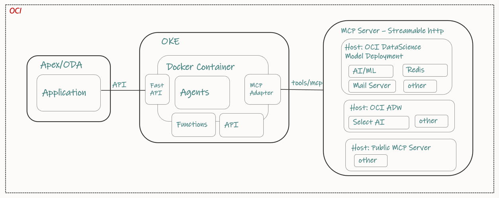

## Oracle Agent Development Kit (ADK) - LandingZone
> The vision of ADK LandingZone is to allow developers to build AI Agents on Oracle Cloud with speed, scalability and reliability. 
> 
> The ADK LandingZone is a python project build using OCI SDK for Agent Development, Oracle GenAI and Agent Services along with few popular open-source framework like Langchain, FastAPI and Streamlit. The design pattern adopted allows reusability of code, good coding practice with security in mind, resulting in developers to focus more on the business logic vs spending time on the agent development engineering concepts.

## ADK REFERENCE ARCHITECTURE
#### How it Works

> Typically your ADK code is embedded in a larger app and is deployed in your environment. Your larger app might be a web app, a Slackbot, a service, or a a script. 

> Through ADK function tools, you can integrate an agent with your local codebase, your remote databases, remote microservices, and so on using the authentication that's native to your environment.

> The ADK calls the agent endpoint, exposed by OCI Generative AI Agents service, which runs the agent loop remotely to your environment.

> When the agent loop decides to call a hosted tool (like a RAG tool), that calls happens without going back to ADK.

> When the agent loop decides to call the local function tools, the control is returned back to the ADK. The ADK calls your local function tools, and submits the function tool output back to Generative AI Agents, which then continues the next iteration of the agent loop.

## Key Concepts of how the ADK Landing Zone is configured

### Applications
> An application is what gets deployed at the client side, for users or machines to interact with.
> Apps can be exposed either as an API or a UI.

### Agent Teams
> A structured sequence of steps or actions that the AI Agent follows to accomplish a specific business task or answer a user query.
Workflow patterns such as Supervisor and Swarm makes up an Agent Team.

### Agents
> Agents handles specific task and is equipped with specific skills that enables it to carry out task. Consider this as a worker behind the scenes to perform actual actions or task that the agent is suppose to deliver to the user.
Agent can connect to other systems, API's or tools, which allows the agent to utilize information from different data sources or business functions.

### Prompt Engineering
> Topics: 
>> Topics define the scope, intent and purpose of an Agent. Topics further refine the Agent's scope and purpose - this is added to the system prompt in instructing an LLM 
Use a consistent pather
Subject Area >> Intent Recognition >> Conversational Flow >> Tool/System integrations >> Contextual Responses

> System Prompt:
>> Each agent has a system prompt. The system prompt defines the Agents personas and capabilities. It establishes the tool it can access. It also describe how the Agent should think about achieving any goals or task for which it was designed.
Use a consistent pattern : 
CONTEXT >> ROLE >> OBJECTIVE >> FORMAT >> TONE / STYLE >> CONSTRAINTS

### llm
> One common place to configure access to OCI-hosted LLMs, BYO LLMs through DataScience Quick Action

### METRO
> MONITORING >> EVALUATION >> TRACING >> REPORTING > OBSERVABILITY

### Guardrails
> 

### MCP Server - 

#### The Model Context Protocol (MCP) is an open standard that enables developers to build secure, two‑way connections between their data sources and AI-powered tools, acting like a “USB‑C port” for AI models to access external context 

> MCP Server 1: 
    >> Deploy Custom functions as tools and make it available through MCP Server
    >>Follow this instruction on how to deploy your tools (Custom Functions) into Oracle DataScience using MCP architecture
https://blogs.oracle.com/ai-and-datascience/post/hosting-mcp-servers-on-oci-data-science

> MCP Server 2:
    >> Create/Deploy MCP Servers for Oracle DB Tools, Redis Cache, Slack 
    >> 
https://github.com/aojah1/mcp

### MCP Client - 
> Support for MCP client is now available on ADK
> 
> A sample code for MCP based agent can be found under : 
    /src/agents/getinsights.py

## Follow the steps below to start building Agents using ADK

### Getting started with OCI Agents in 2 step :
#### Step 1: Infra Provisioning

> Provisioning an agent endpoint using the OCI Console.

> You create an agent instance in the cloud, and provision an agent endpoint under that agent instance. 

> No need to configure routing instructions and tools in UI. ADK automates that for you.

#### Step 2: Configure your development environment

> Fork the repository

    https://github.com/aojah1/adk_projects

> Clone the fork locally

    git clone https://github.com/<your_user_name>/adk_projects.git

### Optional commands
How to actually get Python 3.13 on macOS (change it for your machine)
    
    Option 1 : Homebrew (simplest)
    brew update
    brew install python@3.13          # puts python3.13 in /opt/homebrew/bin
    echo 'export PATH="/opt/homebrew/opt/python@3.13/bin:$PATH"' >> ~/.zshrc
    exec $SHELL                       # reload shell so python3.13 is found
    python3.13 --version              # → Python 3.13.x
    
    Option 2 : pyenv (lets you switch versions)
    brew install pyenv
    pyenv install 3.13.0
    pyenv global 3.13.0
    python --version                  # now 3.13.0

### Client Library
    cd adk_projects

### Configuring and running the agent

    python3.13 -m venv .venv_client
    source .venv_client/bin/activate

### Installing all the required packages
#### After you create a project and a virtual environment, install the latest version of required packages:

    python3.13 -m pip install -r requirements.txt

### Authenticating your ADK app to OCI

> The ADK provides an AgentClient class to simplify handling authentication and management of agent resources. Four authentication types are supported. The API key authentication is the default and most common method for authenticating with OCI services, and this is what we will be using in this project.

> Your OCI config file must be located at `~/.oci/config`. Ensure that this file is properly configured by following this OCI documentation: https://docs.oracle.com/en-us/iaas/Content/API/Concepts/sdkconfig.htm

### Configuring your .env (config) file
> Rename the adk_projects/config/sample_.env to adk_projects/config/.env 

> Change the config variables based on your agents requirements

### Configuring and running an agent - Quick Test

    python3.13 -m src.examples.test_setup  

### Now that you have setup ADK successfully, let's build our first Agent called - TaxAgent

#### Step 1: Build the tools required.
> Based on the business requirements, create tools that would be necessary to execute that business functions.
> Once tools are created, they are visible within the Tools Project and available for use by agents.

Tool 1 : 
    AccountToolkit : Custom functions to get user information (change it to use logged in user info)
    
    python3.13 -m src.toolkit.user_info

Tool 2 : 
    RAG Tool : This is a Pre-built tool available through OCI GenAI Agent Service.

    oci.addons.adk.tool.prebuilt import AgenticRagTool

Note: to use the RAG service, create a Knoweledge base in OCI GenAI Agent Service 
(https://docs.oracle.com/en-us/iaas/Content/generative-ai-agents/create-knowledge-base.htm), in your tenancy, with any pdf related to tax informaiton.
example - https://www.irs.gov/pub/irs-pdf/p463.pdf

#### Step 2: Topic - Defines the areas of expertise through instructions that set the boundaries and constraints for agent conversations and abilities.

Topic: Tax Auditor Agent
    
    python3.13 -m src.prompt_engineering.topics.tax_auditor.py

Sample Instructions: You are a specialized assistant designed to audit and explain tax amounts applied to business transactions.....

#### Step 3: Build/Deploy the Agent - taxagent to GenAI Agent Service to manage deployment
> Now that the foundational components—tools, topics, and instructions—of our agents have been defined, you can create your own agents from scratch.
    
    python3.13 -m src.agents.taxagent

#### Step 4: Run a streamilt app to execute the agent

    python3.13 -m streamlit run src/app/tax_assistant/ui_taxagent.py

sample prompt : Is a $500 client lunch at steakhouse deductible?

#### Extra : If you want to learn how to expose an agent using FastAPI

    python3.13 -m uvicorn src.app.orderxhub.fastapi_orderx:app --reload

### Available OOB Tools from this repo

#### business_objects_tools :
Retrieve data from application database and perform transactions on application business objects as defined in the application OpenAI Spec

> WIP...

#### custom_function_tools :  
Custom functions based on Agents requirements. Examples ...

> src/tools/custom_function/pdf_to_image_tools.py

> src/tools/custom_function/custom_rag/main.py

#### deeplink_tools : 
Send an end user to user form interface to perform specific actions along with the required context

> WIP...

#### document_tool : 
This is a custom Retrieval-Augmented Generation (RAG) to find answers within documents.

> src/tools/document_tool.py

#### email_tools : 
Enable an Agent to write and send an email to a human receipt

> src/tools/email_tools.py

#### external_REST_tools : 
Connect to any service to integrate any data and functionality with a public REST interface

> src/tools/external_REST_tool.py

#### oci_rag_service_tools : 
OCI RAG agent pre-built service as a tool. This is a pre-built RAG tool from OCI GenAI Agent Service. Follow this link to know more about this tool:

> https://docs.oracle.com/en-us/iaas/Content/generative-ai-agents/RAG-tool-create.htm

#### slack_tools : 
Enable an Agent to write and send a slack message to an organization channel.This tool is made available over an MCP Server. See source code here :

> https://github.com/aojah1/mcp/tree/main/mcp_server/slack-mcp-server

#### speech_instruct_tools : 
Convert Speech to Text tool. This is a custom function tool and the source code is available here 

> src/tools/speech_instruct_tools.py

#### vision_instruct_tools : 
Convert Image to Text tool. This is a custom function tool and the source code is available here 

> src/tools/vision_instruct_tools.py

### Deploying your ADK as a package into a Docker Container (e.g OKE)

#### 1. Copy all the files to be packaged under a folder such as adk_projects_package

#### 2. Create Your Python Package

> Build the Package 

    cd adk_projects_package
    python3.13 -m pip install build
    python3.13 -m build --outdir dist

    Note: This creates a dist/ folder with .whl and .tar.gz.

> Verify the Build

    twine check dist/*

#### 3. Create Minimal Dockerfile

> Build and Run the Container

    podman --version
    podman machine list
    podman machine start podman-machine-default
    podman build -t adk_projects_package_image .

    podman run -it adk_projects_package_image python3.13 -c

> Test the Docker Build

> Debug interactively (if needed):
> Run a shell inside the container to inspect:

  podman run -it --rm adk_projects_package_image /bin/bash

> inside the container:
> Check installed packages: 
    pip list | grep adk.

> Test import: 
    python3.13 -c "import adk_projects_package_image; print(adk_projects_package_image.__version__)".

> Check files: ls /app/dist/ (should have the wheel).
    Exit with exit.

#### 4. Publish it to OCI Registry

    podman login container-registry.oracle.com
    - Username: your Oracle account email
    - Password: your OCR Auth Token

> Pull & Run Anywhere:

     podman pull iad.ocir.io/mytenancy/my_package:0.1
     podman run --rm iad.ocir.io/mytenancy/my_package:0.1

#### 5. Deploy into OKE

##### -- Author: Anup Ojah, HPC&AI Leader, Oracle Cloud Engineering
##### References:
https://docs.oracle.com/en-us/iaas/Content/generative-ai-agents/adk/api-reference/introduction.htm

https://www.oracle.com/applications/fusion-ai/ai-agents/

https://docs.oracle.com/en/solutions/ai-fraud-detection/index.html

https://agents.oraclecorp.com/adk/best-practices/separate-setup-run

https://agents.oraclecorp.com/adk/examples/agent-mcp-tool

https://github.com/aojah1/agents/blob/main/Agentic%20Framework_1.2_Feb03_MM_Anup.pdf

